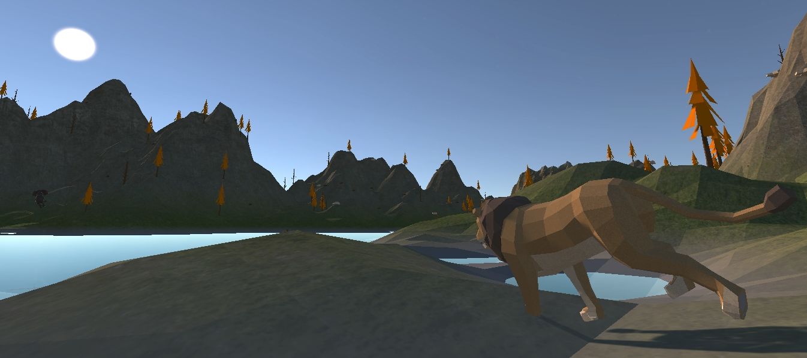

# Virtual Ecosystem Simulator
 

## About
This is a project of a virtual ecosystem simulator, made with Unity Engine and ML-Agents toolkit. 
Animals are driven by inference model based on reinforcement learning, and pattern based on fsm. 
 
 
## Key Features
- 10 species of animals with different characteristics
- Fully selectable populations and species
- Advanced behaviors by inference models using reinforcement learning
- Environmental elements: day, night and weather(rain)
- Randomly generated terrains for every play
- Provides statistics on the stability of the selected ecosystem
 
 

## Installation
If you just need to play the simulator, please skip this section and check the **Pre-built** under the **Usage**.
 
### Prerequisites

- Unity Hub: [3.1.1 or higher](https://unity3d.com/get-unity/download)
- Unity Editor: [2020.3.33f1 LTS or higher](https://unity3d.com/unity/qa/lts-releases?version=2020.3)
- ML-Agents: [release-19](https://github.com/Unity-Technologies/ml-agents/tree/release_19_branch)
 

### Setup

For the Installations below, **Represented versions in the Prerequisites are highly recommended.**

1. Install Unity Hub and Unity Editor.
2. Clone the ML-Agents. Place the folder under the "C:/".
3. Clone this Project and Open it in Unity Editor.
4. Click window->package manager->add package from disk.
5. Select .json file on "C:/ml-agents/com.unity.ml-agents/package.json".
 

### Advanced Setup
 
 

## Usage
### In Unity editor
1. Follow the **Setup** above.
2. Click **StartScene** under "Assets/Scenes", Click the play button in Unity Editor. 
3. Select Species, populations and Days and start play.

 

### Pre-built
**Pre-built Executable file for Windows x86/64, Mac and Linux**
1. Clone this project, go to **build** folder.
2. Run **ecosystem.exe**.
 
 

## Collaborators

Hyeonsu Lee
 

Seungcheol Oh

